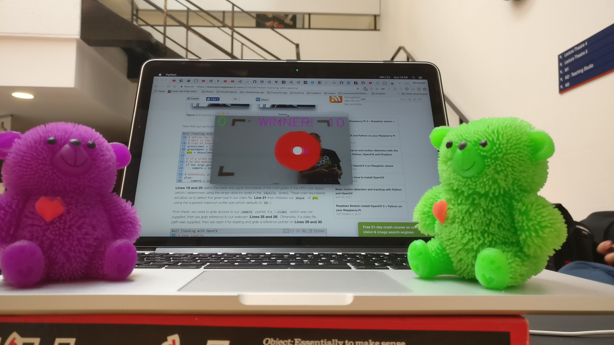

# Winner of CreatED Hackathon - BearSmash

Throw a rubber bear with added ESP8266 (NodeMCU) towards a moving target. ESP8266 measures acceleration, while camera detects the flying bears! This is a fun to play party game, which won the award for the best game and the overall hackathon CreatED 2018.

***
# Development

You will require to isntall Flask, OpenCV and some more libraries before starting. To run the application simply do `python app.py`.

To only test the server side can do:

`FLASK_APP=app.py flask run --host 0.0.0.0`

Browser

`0.0.0.0:5000/hit` - however which will not pass the data about which bear was thrown and at what speed.

***

# Future Devs: 
  1. Speed Detection. 
  2. Target With Multiple Circles 
  3. Hit speed is different for different color circles.

***

Project developed at CreateED Hackathon at Edinburgh 7-8 April 2018.
